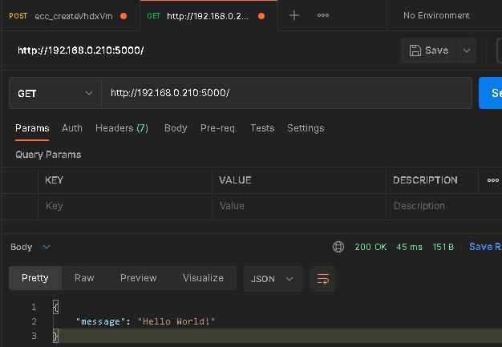

# 
$docker build . -t fastapi
$docker run --restart=always --name fastapiName -d -p 5000:5000 

python/pipenv command 
---
### enter virtual python env
>$ pipenv shell
### show installed packages
>$ pip freeze 